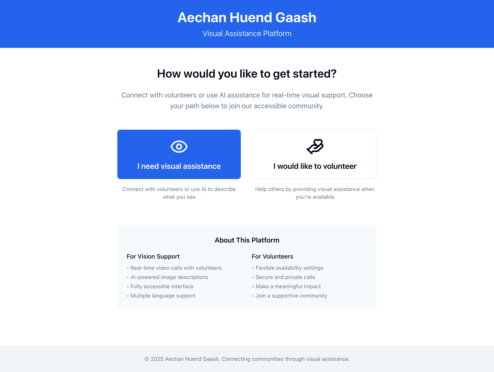
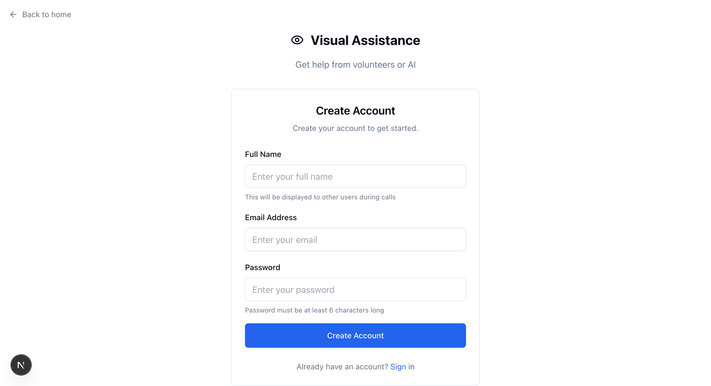
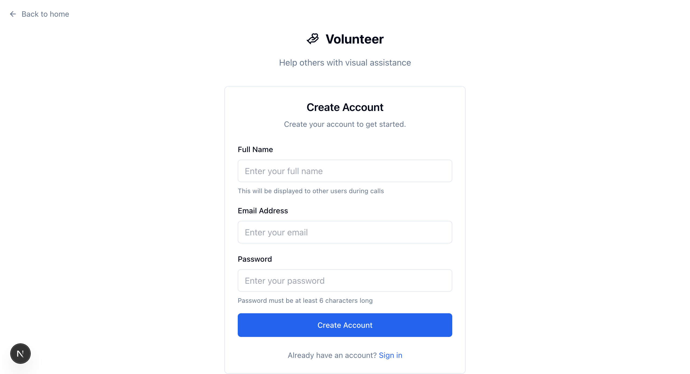
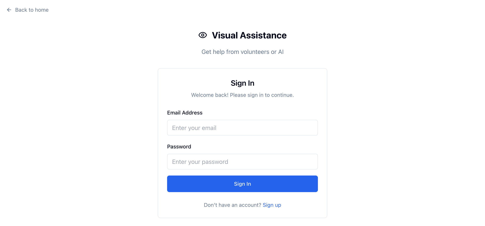
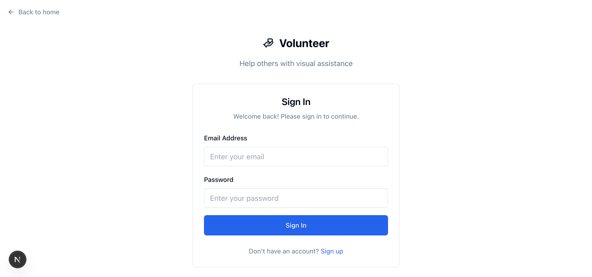
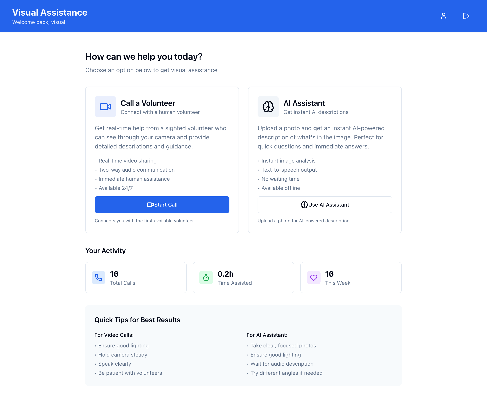
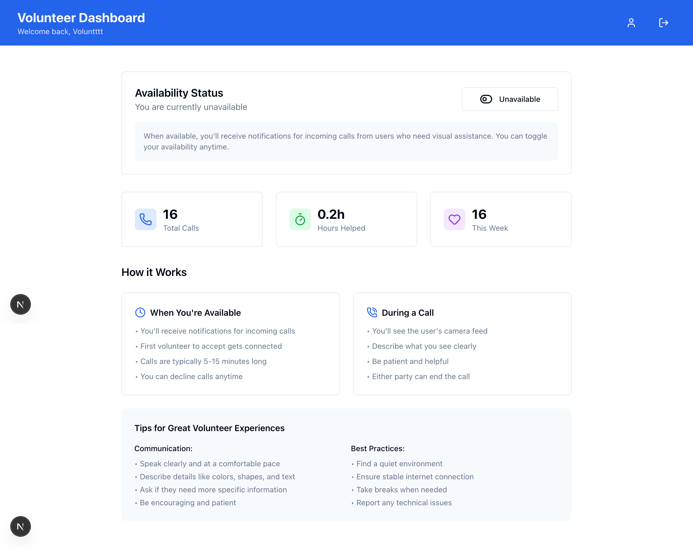
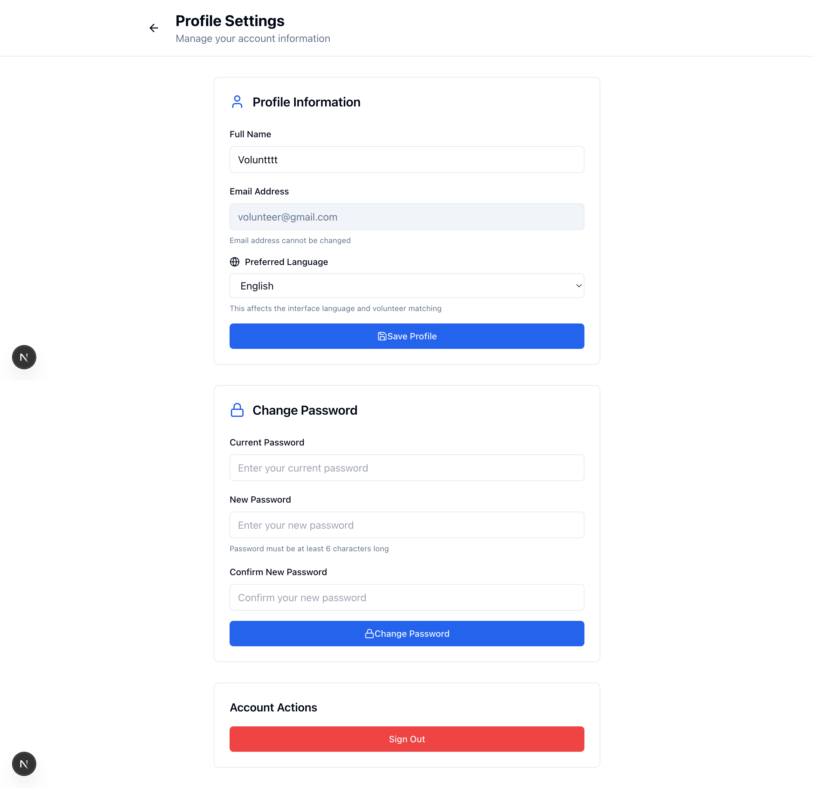
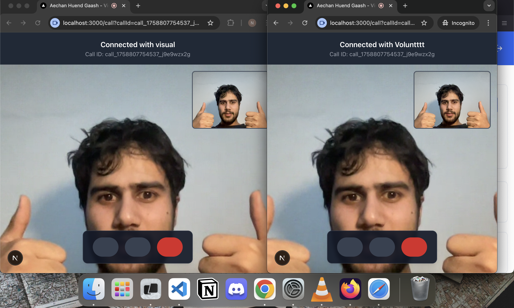

# Aechan Huend Gaash - Visual Assistance Platform

A comprehensive web-based platform that connects blind and low-vision users with sighted volunteers and AI assistance for real-time visual support. Built with Next.js 15, this accessible application enables video calls between users and volunteers, plus AI-powered image descriptions with advanced sound notifications.

## 🌟 Features

### Core Functionality

- **Two User Roles**: VI Users (visually impaired) and Volunteers with role-based dashboards
- **Real-time Video Calls**: Two-way video (VI User to Volunteer) with two-way audio communication
- **AI Assistant**: Google Gemini-powered image analysis with text-to-speech capabilities
- **Smart Sound System**: Audio notifications for call events (incoming, outgoing, connected, ended)
- **Volunteer Matching**: Real-time broadcast system for connecting available volunteers
- **Session Management**: Persistent call sessions with reconnection support
- **User Statistics**: Call tracking, duration monitoring, and volunteer activity metrics

### Advanced Call Features

- **WebRTC P2P Communication**: Direct peer-to-peer video/audio with optimized codecs
- **ICE Server Connectivity Testing**: Network health checks before establishing connections
- **Adaptive Quality Control**: Automatic bandwidth optimization and quality adjustments
- **Connection Recovery**: Automatic reconnection handling and timeout management
- **Multi-language Support**: Interface and audio descriptions in 10+ languages
- **Call Room Management**: Secure room-based call isolation with unique identifiers
- **Volunteer Availability System**: Real-time availability toggling and status management

### Sound Notifications System

- **Incoming Call Sound**: Looping alert for volunteers receiving call requests
- **Outgoing Call Sound**: Connection tone while VI users wait for volunteers
- **Call Connected Sound**: Success notification when calls are established
- **Call Ended Sound**: Closure notification when calls terminate
- **Smart Audio Management**: Automatic sound cleanup and volume control
- **Error Handling**: Graceful fallbacks that don't interrupt app functionality

### Accessibility Features

- **WCAG 2.1 AA Compliance**: Full keyboard navigation and screen reader support
- **Semantic HTML**: Proper heading structure and comprehensive ARIA attributes
- **Large Click Targets**: Optimized for users with motor impairments
- **Text-to-Speech**: AI descriptions read aloud automatically with playback controls
- **High Contrast Support**: Accessible color schemes and visual indicators
- **Reduced Motion**: Respects user preferences for animations and transitions
- **Skip Navigation**: Screen reader shortcuts to main content
- **Focus Management**: Proper focus handling throughout the application

### Security & Authentication

- **NextAuth.js Integration**: Secure authentication with JWT tokens
- **Role-based Access Control**: Separate interfaces for VI Users and Volunteers
- **Session Persistence**: Secure session management across browser sessions
- **Password Encryption**: bcrypt hashing for secure credential storage
- **Protected API Routes**: Server-side authentication checks for all endpoints
- **Database Security**: MongoDB connection with proper data validation

### Technical Features

- **Next.js 15**: Modern React framework with App Router and Server Components
- **Socket.IO**: Real-time bidirectional communication for call signaling
- **MongoDB with Mongoose**: Robust data persistence with schema validation
- **WebRTC**: Peer-to-peer video/audio communication with STUN/TURN servers
- **Google Gemini AI**: Advanced image analysis and natural language descriptions
- **Tailwind CSS**: Responsive, accessible styling with custom components
- **Radix UI Primitives**: Accessible UI components with proper keyboard navigation

## � Screenshots

### Welcome Page
The main landing page where users choose their path - either seeking visual assistance or volunteering to help others. This accessible interface clearly presents both options with descriptive text.



### User Registration
Role-based signup pages tailored for each user type, ensuring the registration process is optimized for the specific needs of VI users and volunteers.

#### VI User Signup


#### Volunteer Signup  


### User Authentication
Accessible signin pages designed for each user role with clear navigation and form validation.

#### VI User Signin


#### Volunteer Signin


### VI User Dashboard

The dashboard for visually impaired users provides quick access to essential features including starting video calls with volunteers and using the AI assistant for image analysis.



### Volunteer Dashboard

Volunteers can toggle their availability, view incoming call requests, and track their volunteer statistics through this dedicated interface.



### User Profile

A comprehensive profile management interface where users can update their preferences, change passwords, and manage account settings with full accessibility support.



### Video Call Interface

The real-time video call interface connecting VI users with volunteers, featuring accessible controls and clear visual indicators for call status.



## �🚀 Getting Started

### Prerequisites

- **Node.js 18+**: Latest LTS version recommended
- **MongoDB**: Local instance or cloud database (MongoDB Atlas)
- **Google Gemini API Key**: For AI image analysis functionality
- **Modern Browser**: Chrome, Firefox, Safari, or Edge with WebRTC support

### Installation

1. **Clone the repository**

   ```bash
   git clone <repository-url>
   cd aechan-huend-gaash
   ```

2. **Install dependencies**

   ```bash
   npm install
   ```

3. **Environment Configuration**

   Copy the example environment file and configure:

   ```bash
   cp .env.local.example .env.local
   ```

   Update `.env.local` with your configuration:

   ```env
   # Database Configuration
   MONGODB_URI=mongodb://localhost:27017/aechan-huend-gaash

   # Authentication
   NEXTAUTH_URL=http://localhost:3000
   NEXTAUTH_SECRET=your-secure-secret-key-here-minimum-32-characters

   # AI Services
   GOOGLE_API_KEY=your-google-gemini-api-key-here

   # Optional: Production settings
   NODE_ENV=development
   ```

4. **Start the development server**

   ```bash
   npm run dev
   ```

5. **Access the application**

   Open [http://localhost:3000](http://localhost:3000) in your browser

### Production Deployment

1. **Build the application**

   ```bash
   npm run build
   ```

2. **Start production server**

   ```bash
   npm start
   ```

## 📱 Usage Guide

### For VI Users (Visually Impaired)

1. **Account Setup**

   - Click "I need visual assistance" on the homepage
   - Create account with email, name, and password
   - Select preferred language for descriptions

2. **Dashboard Features**

   - **Call a Volunteer**: Start a video call with an available volunteer
   - **AI Assistant**: Upload photos for instant AI-powered descriptions
   - **Profile Management**: Update language preferences and account settings
   - **Call History**: View past call statistics and duration

3. **During Calls**

   - Enable camera to share your view with the volunteer
   - Use audio to describe what you need help with
   - Control microphone and camera as needed
   - End calls when assistance is complete

4. **AI Assistant**
   - Upload images directly or use camera capture
   - Receive detailed text descriptions
   - Listen to audio playback of descriptions
   - Re-analyze images with different perspectives

### For Volunteers

1. **Account Setup**

   - Click "I would like to volunteer" on the homepage
   - Create account and complete volunteer profile
   - Set availability preferences

2. **Dashboard Features**

   - **Availability Toggle**: Control when you receive call notifications
   - **Incoming Calls**: Accept or decline call requests from VI users
   - **Statistics**: View your volunteer activity and impact metrics
   - **Profile Management**: Update availability and contact preferences

3. **During Calls**
   - Provide clear, detailed descriptions of what you see
   - Ask clarifying questions to better understand needs
   - Be patient and supportive throughout the interaction
   - End calls professionally when assistance is complete

### Sound System Features

- **Automatic Notifications**: Hear audio cues for all call events
- **Volume Control**: System respects browser audio settings
- **Smart Management**: Sounds automatically stop when appropriate
- **Accessibility**: Audio feedback enhances user experience for all users

## 🏗️ Architecture & Technology Stack

### Frontend Technologies

- **Next.js 15**: React framework with App Router, Server Components, and optimized performance
- **React 19**: Latest React with concurrent features and improved hooks
- **Tailwind CSS**: Utility-first CSS framework with custom accessibility-focused components
- **Radix UI**: Accessible component primitives with keyboard navigation support
- **Lucide React**: Comprehensive icon library with accessibility features

### Backend & API

- **Next.js API Routes**: Server-side endpoints with middleware support
- **Socket.IO Server**: Real-time bidirectional communication with room management
- **NextAuth.js v5**: Modern authentication with JWT and session management
- **bcryptjs**: Secure password hashing and verification
- **Custom Middleware**: Authentication, validation, and error handling

### Database & Data Management

- **MongoDB**: Document-based database with flexible schema
- **Mongoose**: ODM with schema validation, middleware, and query building
- **Data Models**: User, Call, and Session schemas with relationships
- **Indexing**: Optimized queries for user stats and call history
- **Connection Pooling**: Efficient database connection management

### Real-time Communication

- **WebRTC**: Peer-to-peer video/audio with codec optimization
- **Socket.IO**: Signaling server for WebRTC handshake and room management
- **ICE Servers**: STUN/TURN servers for NAT traversal and connectivity
- **Media Constraints**: Optimized video/audio settings for performance
- **Connection Recovery**: Automatic reconnection and timeout handling

### AI & Machine Learning

- **Google Gemini API**: Advanced image analysis and description generation
- **Text-to-Speech**: Browser-based speech synthesis for audio descriptions
- **Image Processing**: Client-side image optimization and validation
- **Multi-language Support**: AI descriptions in 10+ languages

### Audio System

- **Web Audio API**: Advanced sound management and playback control
- **Sound Caching**: Optimized audio instance management
- **Volume Control**: Dynamic volume adjustment and user preferences
- **Error Handling**: Graceful fallbacks for audio failures

## 📂 Project Structure

```
aechan-huend-gaash/
├── public/
│   ├── sounds/                 # Audio notification files
│   │   ├── incoming-call.mp3   # Volunteer incoming call alert
│   │   ├── outgoing-call.mp3   # VI user connection sound
│   │   ├── call-connected.mp3  # Success notification
│   │   └── call-ended.mp3      # Call termination sound
│   └── [static files]          # Icons, images, favicon
├── src/
│   ├── app/                    # Next.js App Router pages
│   │   ├── api/                # API routes
│   │   │   ├── ai/             # AI image analysis endpoints
│   │   │   ├── auth/           # Authentication routes
│   │   │   ├── user/           # User management APIs
│   │   │   └── volunteer/      # Volunteer-specific APIs
│   │   ├── auth/               # Authentication pages
│   │   ├── call/               # Video call interface
│   │   ├── dashboard/          # User dashboards
│   │   │   ├── vi-user/        # VI User dashboard
│   │   │   └── volunteer/      # Volunteer dashboard
│   │   ├── ai-assistant/       # AI image analysis interface
│   │   ├── profile/            # User profile management
│   │   └── [layout & global files]
│   ├── components/             # Reusable UI components
│   │   ├── providers/          # Context providers
│   │   └── ui/                 # Base UI components
│   ├── contexts/               # React contexts (if any)
│   ├── hooks/                  # Custom React hooks
│   │   └── useSocket.js        # Socket.IO connection hook
│   ├── lib/                    # Utility libraries
│   │   ├── auth.js             # NextAuth configuration
│   │   ├── db.js               # Database connection
│   │   ├── env.js              # Environment validation
│   │   ├── utils.js            # General utilities
│   │   └── sounds.js           # Audio management system
│   └── models/                 # Database schemas
│       ├── User.js             # User data model
│       ├── Call.js             # Call session model
│       └── Session.js          # Session management
├── server.js                   # Custom server with Socket.IO
├── next.config.mjs             # Next.js configuration
├── tailwind.config.js          # Tailwind CSS configuration
├── eslint.config.mjs           # ESLint configuration
└── [config files]             # Package.json, etc.
```

## 🔧 API Reference

### Authentication Endpoints

- `POST /api/auth/register` - User registration
- `POST /api/auth/signin` - User authentication
- `GET /api/auth/session` - Session validation

### User Management

- `GET /api/user/profile` - Get user profile
- `PUT /api/user/profile` - Update user profile
- `POST /api/user/change-password` - Change password
- `GET /api/user/stats` - Get user statistics

### Volunteer Management

- `PUT /api/volunteer/availability` - Toggle availability status

### AI Services

- `POST /api/ai/analyze` - Analyze uploaded images

### Socket Events

#### Client → Server

- `join` - User joins with role and profile data
- `start_call` - VI user requests assistance
- `accept_call` - Volunteer accepts call request
- `end_call` - Either party ends the call
- `joinRoom` - Join specific call room
- `offer`, `answer`, `ice-candidate` - WebRTC signaling

#### Server → Client

- `incoming_call` - Notify volunteers of call requests
- `call_connected` - Notify both parties of successful connection
- `call_ended` - Notify call termination
- `call_taken` - Notify call was accepted by another volunteer
- `user_reconnected` - Notify of reconnection events

## 🛠️ Development

### Prerequisites for Development

- Node.js 18+ with npm
- MongoDB running locally or cloud instance
- Google Cloud account with Gemini API access
- Git for version control

### Development Setup

1. **Clone and Install**

   ```bash
   git clone <repository-url>
   cd aechan-huend-gaash
   npm install
   ```

2. **Environment Variables**

   ```bash
   cp .env.local.example .env.local
   # Configure all required environment variables
   ```

3. **Database Setup**

   ```bash
   # If using local MongoDB
   mongod --dbpath /path/to/your/db

   # Or use MongoDB Atlas cloud database
   # Update MONGODB_URI in .env.local accordingly
   ```

4. **Start Development Server**
   ```bash
   npm run dev
   ```

### Available Scripts

- `npm run dev` - Start development server with hot reload
- `npm run build` - Build production application
- `npm run start` - Start production server
- `npm run lint` - Run ESLint for code quality checks

### Code Structure Guidelines

- **Components**: Use functional components with hooks
- **Styling**: Tailwind CSS with accessibility-first approach
- **State Management**: React hooks and context for global state
- **Error Handling**: Comprehensive try-catch blocks and user feedback
- **Accessibility**: WCAG 2.1 AA compliance throughout
- **Performance**: Code splitting and lazy loading where appropriate

### Environment Variables Reference

```env
# Required - Database
MONGODB_URI=mongodb://localhost:27017/aechan-huend-gaash

# Required - Authentication
NEXTAUTH_URL=http://localhost:3000
NEXTAUTH_SECRET=your-secure-secret-minimum-32-characters

# Required - AI Services
GOOGLE_API_KEY=your-google-gemini-api-key

# Optional - Development
NODE_ENV=development
```

### Code Standards

- **JavaScript**: ES6+ with proper error handling
- **CSS**: Tailwind utilities with semantic class names
- **Accessibility**: WCAG 2.1 AA compliance required
- **Performance**: Optimize images, lazy load components
- **Security**: Validate all inputs, sanitize data

---

## 🆘 Support & Troubleshooting

### Getting Help

- **Issues**: Report bugs via GitHub Issues
- **Documentation**: Check inline code comments
- **Community**: Join discussions in repository
- **Support**: Contact maintainers for critical issues

---

**Built with ❤️ for accessibility and inclusion by [Naik Mubashir](https://www.github.com/naikmubashir)**
